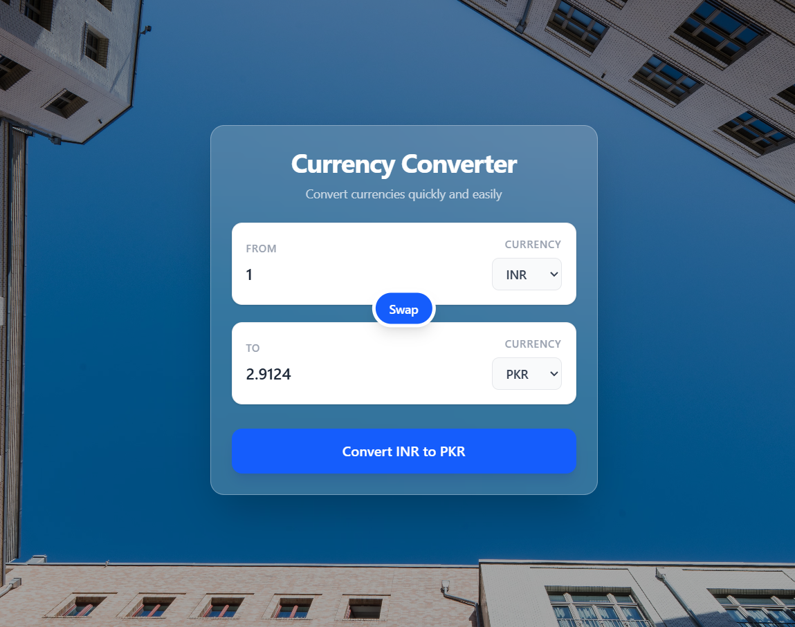

# Currency Converter

A modern and responsive **Currency Converter** built with **React.js** that allows users to convert amounts between different currencies using exchange-rate data.

The application provides a clean and intuitive interface with currency selection, amount conversion, and a convenient swap feature for quickly reversing the conversion direction.

---

## Features

- Convert amounts between multiple currencies
- Fetch exchange-rate data through an API
- Swap source and target currencies
- Dynamic conversion based on selected currencies and amount
- Responsive and user-friendly interface
- Clean and minimal UI
- Built using reusable React components
- Handles different currency combinations dynamically

---

## Screenshots

### INR to PKR



## Tech Stack

- **React.js**
- **JavaScript (ES6+)**
- **HTML5**
- **CSS3**
- **REST API**
- **Vite**

---

## How It Works

1. Enter the amount you want to convert.
2. Select the source currency.
3. Select the target currency.
4. Click the **Convert** button.
5. The application retrieves the exchange rate.
6. The converted amount is displayed.
7. Use the **Swap** button to reverse the currencies.

---

## Project Structure

```text
currency-converter/
│
├── public/
│
├── src/
│   ├── components/
│   ├── App.jsx
│   ├── main.jsx
│   ├── App.css
│   └── index.css
│
├── screenshots/
│   └── inr-to-pkr.png
│
├── package.json
├── vite.config.js
└── README.md
